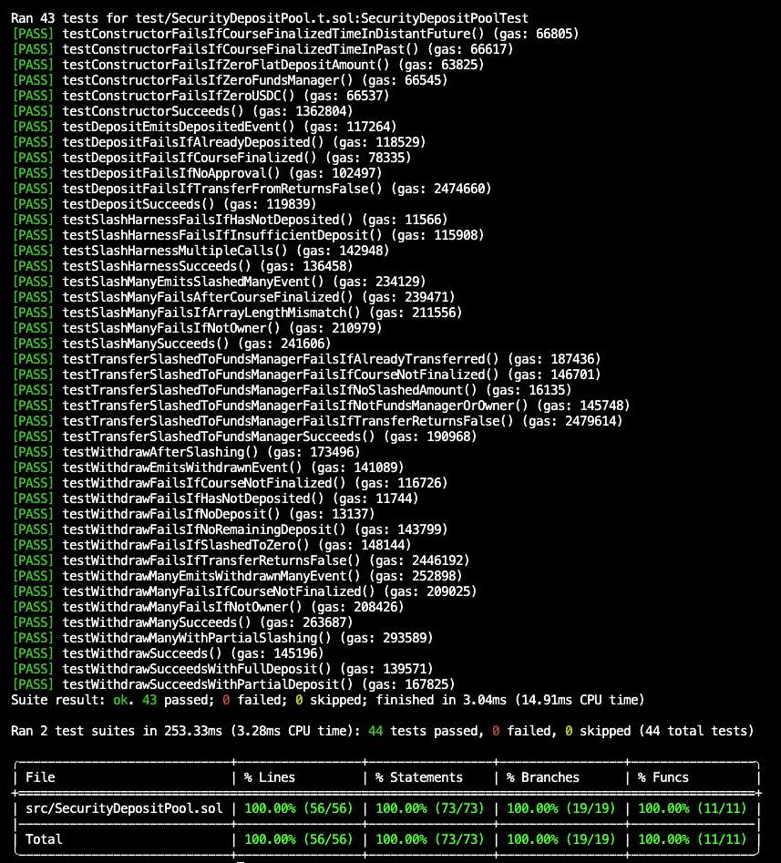

# security-deposit

Security deposit pool for Hell Month.

## Tests information

Coverage is 100%.

If you find any critical vulnerabilities involving theft or loss of funds, please message [@joelmun](https://t.me/joelmun).

## Assumptions

- `fundsManager` is a trusted address chosen by the deployer.
- USDT contract is trusted to be fully functional without any vulnerabilities, which means a reentrancy attack using it is impossible.

## Deployments

### Base Sepolia Testnet

- MockUSDT: https://sepolia.basescan.org/address/0x06E8848DF4ceDBF9b1d401bd4aBC4dBCa836a070
- SecurityDepositPool: https://sepolia.basescan.org/address/0xecb5692f392C013b6513f441cceD19Fb8224f002
