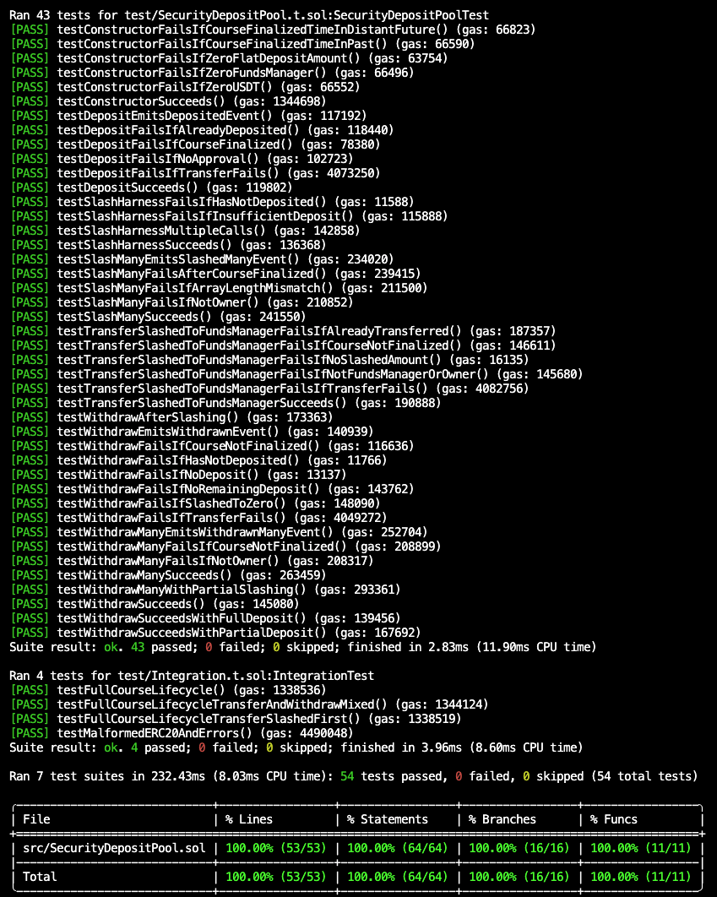

# security-deposit

Security deposit pool for Hell Month.

## Tests information

Coverage is 100%.

If you find any critical vulnerabilities involving theft or loss of funds, please message [@joelmun](https://t.me/joelmun).

## Assumptions

- `fundsManager` is a trusted address chosen by the deployer.
- USDT contract is trusted to be fully functional without any vulnerabilities, which means a reentrancy attack using it is impossible.

## Deployments

### Base Sepolia Testnet

- MockUSDT: https://sepolia.basescan.org/address/0x648f3a5b420F3341Ce0F0A6482D6362B37001189
- SecurityDepositPool: https://sepolia.basescan.org/address/0xb2571AC9863FaBe45C756bE30Bc89Ebd90082fF1
